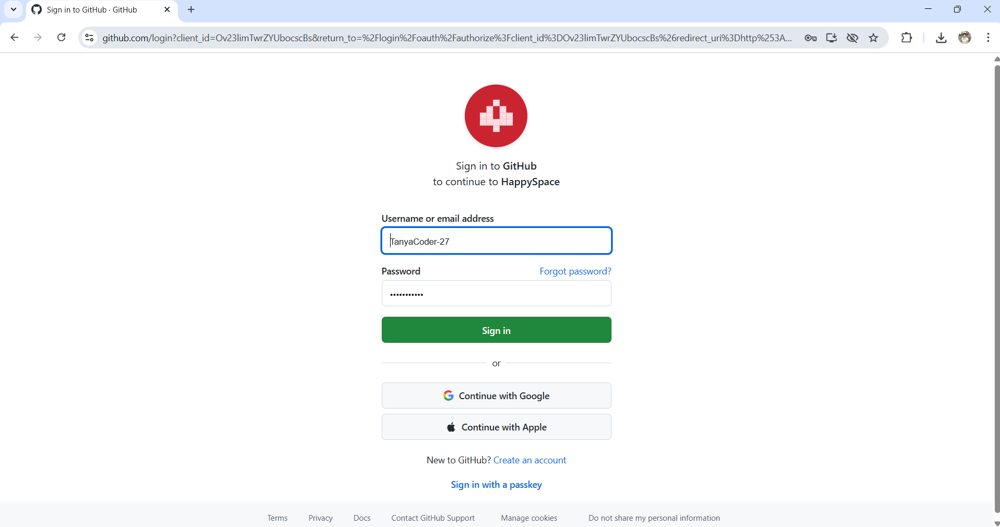

# Happy Space ✨

A joyful MERN application that lets authenticated users search Unsplash images, multi‑select, download, favourite, and revisit their personal search history. Supports OAuth login (Google, Facebook, GitHub) via Passport.js and a polished, cosmic UI.

---

## 1) What’s Included (per assignment)

- Full code in `/client` (React) and `/server` (Express + MongoDB + Passport)
- OAuth + Unsplash integration (Google, Facebook, GitHub + Unsplash Search)
- README with setup instructions and .env details
- Explanation of folder structure
- Postman/cURL examples for all API endpoints
- Visual proof (screenshots/GIFs checklist at the end)

---

## 2) Tech Stack

- Frontend: React (CRA), React Router, CSS Modules
- Backend: Node.js, Express, Passport.js (Google, Facebook, GitHub)
- Database: MongoDB (Mongoose)
- Auth: Express Session + Passport
- External API: Unsplash Search API

---

## 3) Folder Structure

```
.
├─ client/                      # React app (UI)
│  ├─ public/
│  │  ├─ index.html             # HTML shell (favicon/logo set to Happy Space)
│  │  └─ happy-space-logo.svg   # App logo
│  └─ src/
│     ├─ App.js                 # Dashboard (Results / Downloads / Favourites tabs)
│     ├─ HeroLogin.js           # Full‑screen login hero (OAuth buttons)
│     ├─ StarfieldDashboard.module.css  # Cosmic/glass theme styles
│     └─ HeroLogin.module.css   # Colorful login styles
│
└─ server/                      # Express API + Passport + Mongoose
   ├─ index.js                  # Server entry, routes, strategies, CORS, sessions
   └─ models/
      └─ User.js                # User model (OAuth IDs, favourites, downloads)
```

---

## 4) Setup Instructions

### Prerequisites
- Node.js (LTS recommended)
- MongoDB Atlas (or local MongoDB)
- OAuth apps (Google, Facebook, GitHub)
- Unsplash developer access key

### Backend (.env in `/server`)
Create `/server/.env` with:
```
PORT=5000
MONGO_URI=your_mongodb_connection_string
SESSION_SECRET=long_random_string
CLIENT_ORIGIN=http://localhost:3000

UNSPLASH_ACCESS_KEY=your_unsplash_access_key

GOOGLE_CLIENT_ID=your_google_client_id
GOOGLE_CLIENT_SECRET=your_google_client_secret

FACEBOOK_CLIENT_ID=your_facebook_app_id
FACEBOOK_CLIENT_SECRET=your_facebook_app_secret

GITHUB_CLIENT_ID=your_github_client_id
GITHUB_CLIENT_SECRET=your_github_client_secret
```

> OAuth callback URLs (local):
> - Google: `http://localhost:5000/auth/google/callback`
> - Facebook: `http://localhost:5000/auth/facebook/callback`
> - GitHub: `http://localhost:5000/auth/github/callback`

### Frontend (.env in `/client`)
Create `/client/.env` with:
```
REACT_APP_API_URL=http://localhost:5000
```

### Install & Run
Backend:
```
cd server
npm install
node index.js
```
Frontend:
```
cd client
npm install
npm start
```

Open `http://localhost:3000` in your browser.

---

## 5) API Overview

Auth (handled via browser redirects):
- `GET /auth/google`
- `GET /auth/facebook`
- `GET /auth/github`
- `GET /auth/google/callback` (provider redirect)
- `GET /auth/facebook/callback` (provider redirect)
- `GET /auth/github/callback` (provider redirect)
- `GET /auth/me` → returns current user object when authenticated
- `GET /logout` → logs out current session

Search & Data:
- `POST /api/search` body: `{ "term": string, "page"?: number }`
  - returns: `{ term, total, results, page, totalPages }`
- `GET /api/top-searches` → `[ { term, count }, ... ]`
- `GET /api/history` → `[ { term, timestamp }, ... ]` (per‑user)
- `GET /api/downloads` → `{ downloads: ImageMeta[] }` (per‑user)
- `POST /api/downloads` body: `{ images: ImageMeta[] }` (per‑user)
- `GET /api/favourites` → `{ favourites: ImageMeta[] }` (per‑user)
- `POST /api/favourites` body: `{ image: ImageMeta, action: 'add' | 'remove' }` (per‑user)

ImageMeta shape:
```
{
  url: string,          // original/full image URL
  thumb: string,        // small/thumbnail URL
  query: string,        // search term
  timestamp: string,    // saved server-side
  description: string,  // optional
  unsplashId: string    // Unsplash image id
}
```

---

## 6) Postman / cURL Examples

Authentication uses sessions (cookies). For cURL, store and send cookies using `-c cookie.txt -b cookie.txt`.

1) Login via Google (browser flow):
- Visit `http://localhost:5000/auth/google` in a browser. After successful login, a session cookie is set.

2) Verify session:
```
curl -i -c cookie.txt -b cookie.txt http://localhost:5000/auth/me
```

3) Search images (must be logged in):
```
curl -i -c cookie.txt -b cookie.txt \
  -H "Content-Type: application/json" \
  -X POST http://localhost:5000/api/search \
  -d '{"term":"cats","page":1}'
```

4) Get top searches:
```
curl -i -c cookie.txt -b cookie.txt http://localhost:5000/api/top-searches
```

5) Get my search history:
```
curl -i -c cookie.txt -b cookie.txt http://localhost:5000/api/history
```

6) Save downloads (persist selected images):
```
curl -i -c cookie.txt -b cookie.txt \
  -H "Content-Type: application/json" \
  -X POST http://localhost:5000/api/downloads \
  -d '{
        "images": [
          {"url":"https://images.unsplash.com/photo-...","thumb":"https://...","query":"cats","unsplashId":"abc123","description":"cute cat"}
        ]
      }'
```

7) Get my downloads:
```
curl -i -c cookie.txt -b cookie.txt http://localhost:5000/api/downloads
```

8) Add favourite:
```
curl -i -c cookie.txt -b cookie.txt \
  -H "Content-Type: application/json" \
  -X POST http://localhost:5000/api/favourites \
  -d '{
        "image": {"url":"https://images.unsplash.com/photo-...","thumb":"https://...","query":"cats","unsplashId":"abc123","description":"cute cat"},
        "action":"add"
      }'
```

9) Remove favourite:
```
curl -i -c cookie.txt -b cookie.txt \
  -H "Content-Type: application/json" \
  -X POST http://localhost:5000/api/favourites \
  -d '{
        "image": {"unsplashId":"abc123"},
        "action":"remove"
      }'
```

10) Logout:
```
curl -i -c cookie.txt -b cookie.txt http://localhost:5000/logout
```

> Tip: In Postman, first run the browser OAuth login at `/auth/google` to set cookies, then call the authenticated endpoints using the same base URL. Or use Postman’s cookie manager to import cookies from your browser.

---

## 7)📸 Visual Proof

-  OAuth login (Google/Facebook/GitHub screen )
-  Google Accounts (Gmails)
-  Initial page after logged in
-  Search Results , Search History and Multi-selected options
-  Multi-Image Download
-  Downloads done
-  Favourites tab
-  Full Image model
-  Downlaoded image view
-  Sign in with Github
-  Other user view of the page after logged in
-  MongoDB searches Table
-  MongoDB users Table

### Demo Video for clear functionalities view 🎥  
Watch the Happy Space walkthrough:  
[Click to view on Google Drive](https://drive.google.com/file/d/1nYxEUFc9XbOW698Qy678krUMiDxeqKkS/view?usp=sharing)
---

## 8) Notes & Decisions
- Google login enforces account chooser with `prompt=select_account`.
- Facebook uses `authType=reauthenticate` to reduce silent reuse of last account.
- Unsplash is called server‑side for security; the server returns only what the UI needs.
- User data (downloads, favourites, history) are stored per‑user in MongoDB.

---

## 9) License
This project is for educational/demo purposes.
